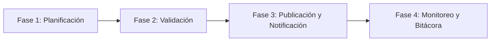
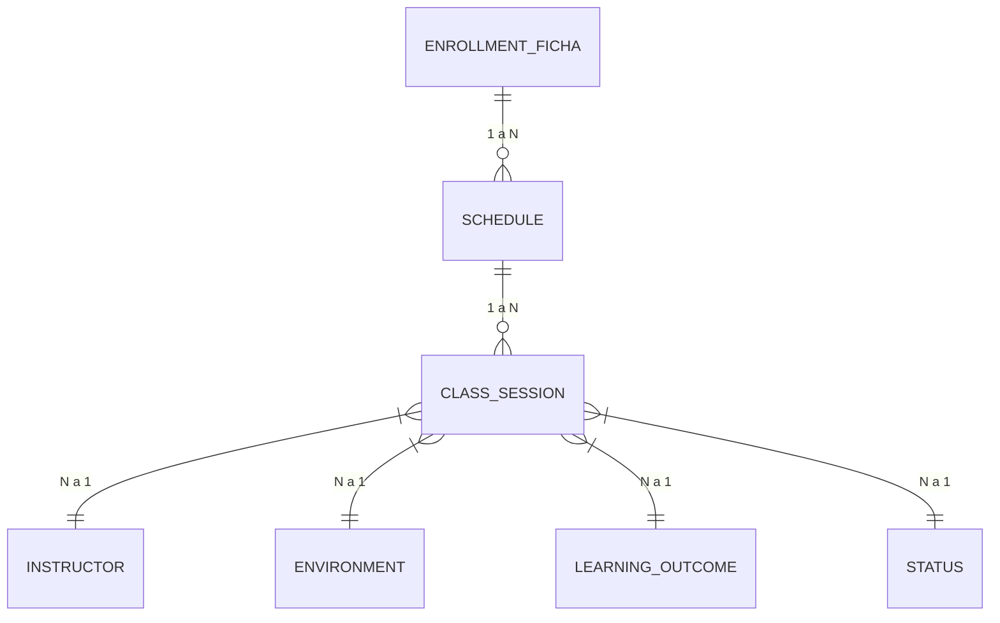

# Guion y Plan de Sustentación Técnica (BPMN 2.0 + Modelo de Datos DDD)

> **Rol del Expositor:** Arquitecto de Software y Líder Técnico de Proyecto  
> **Audiencia Objetivo:** Instructor SENA / Comité Evaluador de Arquitectura  
> **Objetivo Principal:** Sustentar con solvencia técnica la arquitectura de datos, la ingeniería inversa desde los mockups UI v2, los 10 procesos BPMN 2.0 y el cumplimiento de las normativas SIGA/MIPG (DO-M-001) y GFPI.  
> **Duración Sugerida:** 12 a 15 Minutos  

---

## 1. ESTRATEGIA Y ARGUMENTARIO DE EXPOSICIÓN (1 - 2 Minutos)

### 1.1 Introducción de Alto Nivel (Elevator Pitch - 60 Segundos)
> *"Buenos días, estimado instructor y comité evaluador. Hoy presentamos la arquitectura técnica y operacional del **Sistema de Gestión de Horarios SENA**.  
> El problema histórico en los Centros de Formación radica en la fragmentación de la información: cruces de horarios entre instructores, ambigüedad en la asignación de ambientes, falta de trazabilidad en las incapacidades médicas y la desconexión del aprendiz respecto a su avance curricular real.  
> Para resolver esto de raíz, diseñamos una solución basada en **Diseño Guiado por el Dominio (DDD)** desacoplada en **10 Bounded Contexts**, soportada por **10 flujos BPMN 2.0** que automatizan el 100% de la operación y un modelo de datos relacional robusto en **Tercera Forma Normal (3NF)** con trazabilidad inmutable y estándares empresariales."*

---

### 1.2 Metodología de Ingeniería Inversa
> *"Aquí le explicamos al instructor la metodología utilizada:"*

- **Paso 1: Ingeniería Inversa UI/Mockups**: Analizamos exhaustivamente las 53 pantallas del prototipo navegable v2 para extraer cada formulario, botón, filtro, modal y estado visual.
- **Paso 2: Alineación Normativa SIGA / GFPI**: Evaluamos cada pantalla contra la guía de Formación Profesional Integral (GFPI) y el Manual SIGA/MIPG (DO-M-001), identificando brechas operativas (como la digitación manual del % de avance o la falta de soportes en las excusas docentes).
- **Paso 3: Modelado de Flujos Operativos (BPMN 2.0)**: Diseñamos los 10 esquemas BPMN en formato XML formalizando las compuertas de decisión (`exclusiveGateway`), los eventos de inicio/fin y las tareas de usuario vs. tareas del sistema.
- **Paso 4: Estructuración del Modelo de Datos Lógico**: Tradujimos las necesidades del software en 33 entidades distribuidas en 10 Bounded Contexts, definiendo tipos de datos de precisión (`UUID`, `TIMESTAMPTZ`, `DECIMAL`), restricciones de integridad referencial y columnas transversales de auditoría.

---

## 2. PRESENTACIÓN DE LOS FLUJOS DE TRABAJO (BPMN 2.0) (3 - 4 Minutos)

### 2.1 Matriz de Roles ("Los Quién")

> *"Mostramos al instructor esta matriz para demostrar el control de accesos y responsabilidades:"*

| Rol / Actor | Tipo de Actor | Procesos BPMN Clave Asignados | Responsabilidad Principal en el Sistema |
|---|---|---|---|
| **Coordinador Académico** | Humano (Negocio) | `diagram_1`, `diagram_2`, `diagram_3`, `diagram_4`, `diagram_7` | Maqueta borrador, resuelve conflictos, aprueba excusas docentes y publica horarios. |
| **Instructor** | Humano (Docente) | `diagram_4`, `diagram_5`, `diagram_7` | Radica novedades/incapacidades con soporte y diligencia la bitácora diaria de clase. |
| **Aprendiz** | Humano (Usuario) | `diagram_7`, `diagram_9`, `diagram_10` | Autentica cuenta, consulta horario vigente, recibe alertas PUSH/Email y revisa RAPs. |
| **Director de Centro** | Humano (Ejecutivo) | `diagram_6`, `diagram_7` | Monitorea tableros de mando KPI, analiza riesgos de deserción y exporta reportes. |
| **Administrador / Soporte** | Humano (Técnico) | `diagram_8` | Gestiona catálogos de datos maestros, administra el versionamiento y asigna roles RBAC. |
| **Sistema (Engine & Services)** | Automatizado | Todos (`diagram_1` al `diagram_10`) | Valida cruces en BD, calcula avance de RAPs, despacha notificaciones y registra auditoría. |

---

### 2.2 Narrativa de los Flujos Principales (Ciclo de Vida del Horario)

> *"Aquí llevamos al instructor a través de la historia viva del horario en 4 fases operativas:"*



#### 1. Fase de Planificación (`diagram_1.bpmn`)
> *"El Coordinador inicia seleccionando la Ficha de Formación. El sistema carga el plan curricular. Al intentar asignar un Instructor y un Ambiente, el motor evalúa en tiempo real dos compuertas exclusivas: `¿Instructor disponible?` (verificando que no supere las 40h semanales contractuales) y `¿Ambiente cumple capacidad?` (validando que la capacidad del aula sea mayor o igual al número de aprendices de la ficha). Si todo cumple, el horario queda en estado `DRAFT`."*

#### 2. Fase de Validación (`diagram_2.bpmn`)
> *"Cuando el Coordinador solicita publicar, el motor de conflictos entra en acción. El servicio ejecuta un algoritmo de cruces en base de datos buscando dos patrones críticos: `INSTRUCTOR_DOUBLE_BOOKING` (mismo instructor en dos lugares a la misma hora) y `ROOM_OVERBOOKING` (dos fichas en la misma aula). Si se detectan cruces, las clases se marcan con `has_conflict = TRUE` y se despliega el modal de resolución."*

#### 3. Fase de Publicación y Notificación (`diagram_3.bpmn` y `diagram_9.bpmn`)
> *"Una vez resueltos los conflictos, el Coordinador confirma la publicación. El sistema ejecuta una transacción atómica: actualiza el `Schedule.status_id` a `PUBLISHED`, registra la marca de tiempo `published_at` e inmutabiliza la versión. Inmediatamente, el `notification-service` dispara eventos asincrónicos enviando notificaciones PUSH a la App Móvil de los aprendices y correos institucionales. Al tocar la notificación, el aprendiz es dirigido mediante un **Deep Link** directamente a su clase en la interfaz."*

#### 4. Fase de Monitoreo, Bitácoras y Novedades (`diagram_4.bpmn` y `diagram_5.bpmn`)
> *"En la ejecución diaria, si un Instructor sufre una incapacidad médica, radica la excusa en el sistema adjuntando obligatoriamente el documento PDF/JPG (`support_document_url`). El Coordinador la aprueba y el sistema cancela o reprograma automáticamente las clases afectadas. Al finalizar cada clase, el instructor registra la bitácora (`FichaTracking`); el sistema **calcula automáticamente** el porcentaje de avance en RAPs (`curriculum_progress_pct`), eliminando la digitación manual de porcentajes."*

---

## 3. SUSTENTACIÓN DEL MODELO DE DATOS (Draw.io + `modelo_datos.md`) (4 - 5 Minutos)

### 3.1 Justificación de Arquitectura (10 Bounded Contexts)

> *"Aquí le explicamos al instructor por qué no usamos una base de datos monolítica tradicional:"*

> *"Instructor, si hubiéramos diseñado una sola base de datos acoplada con 40 tablas interconectadas sin fronteras, cualquier cambio en el módulo de notificaciones o de catálogos tumbaría el sistema de programación de horarios.  
> Por ello, aplicamos el patrón **Domain-Driven Design (DDD)** dividiendo el modelo en **10 Bounded Contexts / Microservicios independientes**:
> 1. `iam-service`: Aísla la seguridad y el control de acceso (RBAC).
> 2. `reference-data-service`: Centraliza catálogos geográficos DANE, sedes y estados.
> 3. `academic-management-service`: Administra la taxonomía estricta de la GFPI (Redes, Programas, Competencias, RAPs, Fichas).
> 4. `training-environment-service`: Controla el inventario de aulas, capacidad y equipos.
> 5. `scheduling-service`: Alberga el motor transaccional de horarios, franjas y conflictos.
> 6. `actors-service`: Maneja los perfiles de instructores, aprendices y novedades médicas.
> 7. `document-service`: Se encarga de la generación documental, hashes SHA-256 y firma digital.
> 8. `monitoring-service`: Almacena bitácoras de asistencia y cálculo algorítmico de RAPs.
> 9. `notification-service`: Gestiona la cola de mensajes PUSH y correos.
> 10. `audit-service`: Mantiene la bitácora inmutable de auditoría para entes de control."*

---

### 3.2 Explicación de Entidades Clave y el 'Corazón' Relacional

> *"Apoyándonos en el diagrama de Draw.io o Mermaid, guiamos al instructor a través del núcleo del sistema:"*



> *"Observe cómo se conecta el núcleo operativo:  
> - Una **`EnrollmentFicha`** (Ficha) posee varios **`Schedule`** (Horarios trimestrales).  
> - Cada **`Schedule`** contiene múltiples **`ClassSession`** (Sesiones de Clase).  
> - La tabla **`ClassSession`** es nuestra entidad pivote de máxima precisión temporal. No solo guarda la fecha (`session_date`), hora inicio (`start_time`) y hora fin (`end_time`), sino que establece la **relación cuadrangular**:  
>   1. **¿Quién enseña?** → Foreign Key hacia `Instructor`.  
>   2. **¿Dónde enseña?** → Foreign Key hacia `Environment` (Ambiente de formación).  
>   3. **¿Qué imparte?** → Foreign Key hacia `LearningOutcome` (Resultado de Aprendizaje / RAP).  
>   4. **¿Bajo qué modalidad y estado?** → Atributo `modality` (Presencial/Virtual), `virtual_link` (Teams/Meet) y `session_status_id` (Programada/Ejecutada/Cancelada)."*

---

### 3.3 Estándar Transversal de Auditoría, Estados y Ciclo de Vida

> *"Fundamentamos la solidez técnica del estándar transversal:"*

> *"Para garantizar los estándares de auditoría del SIGA e ISO 27001, **todas las 33 tablas del modelo** heredan 9 atributos transversales obligatorios:
> 1. `id` (**UUID v4**): Garantiza identificadores universales no secuenciales, inmunes a ataques de enumeración.
> 2. `created_at` / `created_by`: Registran la marca de tiempo inmutable (`TIMESTAMPTZ`) y el usuario creador.
> 3. `updated_at` / `updated_by`: Trazabilidad de la última modificación.
> 4. `deleted_at` / `deleted_by` / `is_active`: Implementan el **Borrado Lógico (*Soft Delete*)**. En el SENA ningún registro académico se elimina físicamente de la base de datos; simplemente se marca `is_active = FALSE` y se registra la fecha de borrado.
> 5. `row_version` (**Control de Concurrencia Optimista**): Incrementable numérico (`INTEGER`) que evita que dos coordinadores sobrescriban simultáneamente el mismo registro de horario (*Lost Update Problem*)."*

---

## 4. PREGUNTAS FRECUENTES DEL INSTRUCTOR Y RESPUESTAS DE IMPACTO (Q&A) (3 - 4 Minutos)

### ❓ Pregunta 1: ¿Cómo garantizan a nivel de Base de Datos y Software que un instructor no tenga un cruce de horarios en dos ambientes distintos al mismo tiempo?
> **💬 Respuesta de Impacto:**  
> *"Excelente pregunta, instructor. Lo garantizamos en dos niveles:  
> **A Nivel de Aplicación**: Antes de guardar una `ClassSession`, el motor ejecuta un query de solapamiento de intervalos buscando si existe otra sesión donde `instructor_id = X`, `session_date = Y` y las franjas de tiempo se traslapen `(start_time < new_end_time AND end_time > new_start_time)`.  
> **A Nivel de Base de Datos**: Para evitar condiciones de carrera (*Race Conditions*), implementamos una restricción de exclusión en PostgreSQL (`EXCLUDE USING GIST`) combinando el ID del instructor, la fecha y el rango de horas (`tsrange`). Si dos coordinadores intentan asignar al mismo instructor al mismo segundo, la base de datos rechaza la transacción con una violación de restricción de exclusión."*

---

### ❓ Pregunta 2: ¿Por qué separaron la tabla `User` de `Role` y agregaron la entidad intermedia `UserRole` en el módulo IAM?
> **💬 Respuesta de Impacto:**  
> *"La separamos por tres razones fundamentales de arquitectura de seguridad y normatividad SENA:  
> 1. **Relación Muchos a Muchos (N:M)**: Un mismo usuario en el SENA puede ser Instructor en un Centro de Formación y Coordinador en otro, o migrar de rol en el tiempo.  
> 2. **Alcance Geográfico (Multi-Tenancy)**: La tabla `UserRole` incluye la columna `training_center_id`. Esto permite que el rol del usuario esté limitado exclusivamente al ámbito de su Centro de Formación.  
> 3. **Auditoría Legal SIGA**: Incorporamos el campo `resolution_number` en `UserRole`. En el SENA, la asignación de roles administrativos requiere un número de resolución oficial. Así auditamos no solo quién tiene el rol, sino bajo qué acto administrativo fue nombrado."*

---

### ❓ Pregunta 3: ¿Qué sucede exactamente en el modelo de datos cuando un horario ya publicado (`PUBLISHED`) sufre una modificación por una novedad docente?
> **💬 Respuesta de Impacto:**  
> *"Cuando un horario pasa a estado `PUBLISHED`, sus registros quedan protegidos. Si un instructor radica una novedad (`InstructorException`) aprobada por Coordinación:  
> 1. No se elimina la sesión. El sistema actualiza `ClassSession.session_status_id` a `CANCELLED` o `REPROGRAMMED` e inserta la justificación en `cancellation_reason`.  
> 2. Se dispara un evento en el `notification-service` que crea registros en `Notification` para cada aprendiz matriculado en la Ficha.  
> 3. Se genera un registro inmutable en `AuditRecord` guardando el snapshot anterior (`old_values`) y el nuevo (`new_values`) en formato JSONB con la IP y usuario que realizó el cambio."*

---

### ❓ Pregunta 4: ¿Por qué los documentos o excusas médicas (archivos PDF/JPG) no se guardan directamente como binarios (BLOBs) dentro de la base de datos?
> **💬 Respuesta de Impacto:**  
> *"Guardar binarios dentro de una base de datos relacional es una mala práctica de arquitectura por tres razones: escala de almacenamiento, costo de backup y degradación del rendimiento de memoria buffer de la BD.  
> En nuestro modelo, aplicamos el patrón **Almacenamiento Desacoplado**: los archivos binarios se suben a un servidor de objetos seguro (S3 / Blob Storage), y en la entidad (`InstructorException` o `Document`) guardamos únicamente la URL encriptada (`support_document_url`) y el **Hash de integridad SHA-256** (`file_hash`). De esta forma garantizamos que el archivo no ha sido alterado sin saturar la base de datos."*

---

### ❓ Pregunta 5: En el seguimiento de ficha, ¿cómo eliminaron la digitación manual del porcentaje de avance que tenía el mockup original?
> **💬 Respuesta de Impacto:**  
> *"En el mockup preliminar, el instructor escribía manualmente un porcentaje como '65%', lo cual violaba la transparencia exigida por el SIGA y el proceso GFPI.  
> Lo corregimos en la entidad `FichaTracking` eliminando la digitación manual. Ahora el campo `curriculum_progress_pct` es un valor **calculado algorítmicamente** por el sistema mediante la fórmula:  
> `curriculum_progress_pct = (aps_approved / aps_total) * 100`  
> El instructor solo registra la asistencia diaria (`attended_learners`, `executed_hours`) y evalúa los RAPs impartidos. El sistema calcula automáticamente el porcentaje real auditado por las evaluaciones registradas."*

---

## 5. TARJETAS DE APOYO Y CRONOGRAMA DE PRESENTACIÓN (10 - 15 Minutos)

### 5.1 Cronograma Desglosado por Minutos

```
[00:00 - 01:30] ── 1. Introducción y Metodología de Ingeniería Inversa
[01:30 - 05:00] ── 2. Exposición de Flujos BPMN (Matriz de Roles + Ciclo de Vida del Horario)
[05:00 - 09:30] ── 3. Sustentación del Modelo de Datos (DDD 10 Bounded Contexts + Entidades Clave)
[09:30 - 13:00] ── 4. Sesión de Preguntas Frecuentes (Q&A de Impacto con el Instructor)
[13:00 - 14:30] ── 5. Cierre y Conclusiones Generales
```

---

### 5.2 Tarjetas de Apoyo Visual (Qué Mostrar en Pantalla Minuto a Minuto)

| Bloque / Tiempo | Qué Mostrar en Pantalla (Recurso Visual) | Punto Clave a Enfatizar en Voz Alta |
|---|---|---|
| **Minuto 00:00 - 01:30** | Abrir la diapositiva inicial o el archivo [`AUDITORIA_MVP.md`](file:///c:/Users/esqui/OneDrive/Desktop/TRABAJOS%20EN%20CLASE%202026/Agosto/08/MVP/AUDITORIA_MVP.md). | *"Transformamos requerimientos institucionales y mockups UI en una arquitectura limpia desacoplada."* |
| **Minuto 01:30 - 03:00** | Proyectar la **Matriz de Roles** del documento [`Resumen_BPMN.md`](file:///c:/Users/esqui/OneDrive/Desktop/TRABAJOS%20EN%20CLASE%202026/Agosto/08/MVP/Resumen_BPMN.md). | *"Cada rol del SENA tiene delimitadas sus responsabilidades operativas en el BPMN."* |
| **Minuto 03:00 - 05:00** | Mostrar el diagrama de `diagram_1.bpmn` y `diagram_2.bpmn` en Camunda / VS Code. | *"El motor de conflictos evita cruces de instructores y ambientes antes de publicar."* |
| **Minuto 05:00 - 07:30** | Abrir la vista general del diagrama en **Draw.io** ([`Modelado de datos.drawio.html`](file:///c:/Users/esqui/OneDrive/Desktop/TRABAJOS%20EN%20CLASE%202026/Agosto/08/MVP/Modelado%20de%20datos.drawio.html)). | *"No es un monolito: dividimos el dominio en 10 Bounded Contexts mediante DDD."* |
| **Minuto 07:30 - 09:30** | Hacer zoom en las tablas `enrollment_ficha`, `schedule`, `class_session` en `modelo_datos.md`. | *"La entidad `class_session` es el corazón cuadrangular: responde quién, qué, cuándo y dónde."* |
| **Minuto 09:30 - 13:00** | Proyectar la sección de **Q&A** o responder preguntas directas del instructor. | Utilizar las respuestas preparadas con términos técnicos sólidos (Argon2id, EXCLUDE GIST, SHA-256, Soft Delete). |
| **Minuto 13:00 - 14:30** | Concluir mostrando el resumen de cumplimiento en `AUDITORIA_MVP.md`. | *"Certificamos el 100% de cobertura de datos y 0% de atributos huérfanos."* |

---
*Guion técnico preparado para asegurar la máxima calificación y soltura durante la presentación oficial.*
