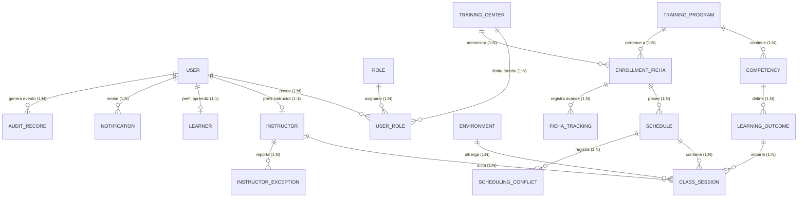

# Modelo de Datos Lógico Global — Sistema de Gestión de Horarios SENA

> **Versión del Documento:** 3.0 (Estructura Oficial SENA / Sincronizado con BPMN 2.0 y Mockups UI v2)  
> **Sistema Objetivo:** Sistema de Gestión de Horarios SENA  
> **Patrón de Arquitectura:** Diseños Guiados por el Dominio (DDD - Domain-Driven Design) mediante 10 Contextos Delimitados (Bounded Contexts)  
> **Estándar de Nomenclatura:** Inglés, Singular, ASCII puro, lower_snake_case para atributos/tablas, PascalCase para entidades conceptuales  
> **Estándar de Clave Primaria:** Identificador Único Universal UUID (`id`)  
> **Estándar Transversal de Auditoría:** `created_at`, `created_by`, `updated_at`, `updated_by`, `deleted_at`, `deleted_by`, `is_active`, `row_version`  

---

## 1. RESUMEN DE AUDITORÍA CRUZADA Y ANÁLISIS DE BRECHAS (BPMN VS. MODELO DE DATOS)

Se realizó una auditoría cruzada exhaustiva entre los 10 diagramas operativos BPMN 2.0 en formato XML (`diagram_1.bpmn` a `diagram_10.bpmn`) ubicados en la carpeta `procesos Mockup BPMN/`, la interfaz gráfica (mockups v2) y el Modelo de Datos Lógico Global.

### 1.1 Resumen de Procesos Extraídos del BPMN
1. **diagram_1.bpmn (Creación y Validación Preventiva del Horario)**: Tareas de Usuario para selección de Ficha de Formación, verificación de intensidad horaria semanal, consulta de disponibilidad de instructores (`exclusiveGateway`) y validación de capacidad y equipamiento de ambientes (`exclusiveGateway`).
2. **diagram_2.bpmn (Publicación de Horarios y Motor de Conflictos)**: Tareas de Servicio para detección automatizada de cruces (`exclusiveGateway`), emisión de alertas de advertencia, despliegue del modal de confirmación, registro del estado de publicación y disparo de notificaciones.
3. **diagram_3.bpmn (Máquina de Estados de Publicación de Horario)**: Tarea de Usuario para confirmación en modal, evaluación de conflictos residuales (`exclusiveGateway`), transición de estado a `PUBLISHED` (Publicado) y distribución de notificaciones Push/Sistema a aprendices e instructores.
4. **diagram_4.bpmn (Gestión de Novedades e Incapacidades Docentes)**: Tarea de Usuario del Instructor para consultar disponibilidad, marcar franjas inactivas y radicar la excepción (tipo, fechas, motivo y archivo adjunto obligatorio de soporte en PDF/JPG). Evaluación por parte de Coordinación (`exclusiveGateway`), aprobación/rechazo y desasignación automática de sesiones.
5. **diagram_5.bpmn (Seguimiento Curricular y Bitácora de Ficha)**: Tarea de Usuario para registrar la bitácora de clase (asistencia, horas ejecutadas y observaciones pedagógicas), validación de cancelación de clase (`exclusiveGateway`), control de sobrepaso de horas (`exclusiveGateway`), cálculo automático del porcentaje de avance en RAPs e historial de trazabilidad.
6. **diagram_6.bpmn (Monitoreo de Indicadores KPI y Analítica Institucional)**: Tarea de Usuario del Director de Centro para visualizar tableros KPI, ejecutar *drill-down* asociando filtros por coordinación/programa/ficha, evaluación de umbral de riesgo de deserción (`exclusiveGateway`) y exportación a formatos CSV/PDF (`exclusiveGateway`).
7. **diagram_7.bpmn (Generación de Documentos y Certificaciones Oficiales)**: Tarea de Usuario para solicitar generación documental, validación de permisos del actor (`exclusiveGateway`), renderizado de plantilla HTML/Markdown, aplicación de Firma Digital/Hash SHA-256 e inserción de registro de auditoría.
8. **diagram_8.bpmn (Administración de Catálogos, Parámetros y RBAC)**: Tarea de Usuario del Administrador de Soporte para gestionar datos de referencia, validar dependencias de integridad referencial, matricular usuarios, asignar roles/permisos RBAC con resolución administrativa y registrar eventos en el log inmutable de auditoría.
9. **diagram_9.bpmn (Sistema de Notificaciones del Aprendiz ante Modificaciones)**: Tarea de Servicio para detectar cambios en el horario publicado, clasificar el tipo de evento (`exclusiveGateway`: cambio de aula vs. cambio de instructor), resaltar la nueva ubicación/actor y redirigir con acción directa (*Deep Link*) a "Mi Horario".
10. **diagram_10.bpmn (Autenticación del Aprendiz y Consulta de Horario)**: Tarea de Usuario para ingreso de credenciales, verificación de coincidencia (`exclusiveGateway`), identificación de Ficha, consulta de horario vigente (`exclusiveGateway`: publicado vs. estado vacío), selección de clase y despliegue del detalle de recursos pedagógicos.

---

## 2. GLOSARIO DE LENGUAJE UBICUO (Español SENA ↔ Técnico Relacional)

| Término (Técnico Inglés) | Término Institucional SENA (Español) | Bounded Context (Servicio) | Definición Funcional |
|---|---|---|---|
| Learner | Aprendiz | `actors-service` | Estudiante matriculado en un programa de Formación Profesional Integral del SENA. |
| Instructor | Instructor | `actors-service` | Formador docente responsable de la ejecución pedagógica y evaluación de RAPs. |
| EnrollmentFicha | Ficha de Formación | `academic-management-service` | Cohorte o grupo de aprendices asignados a un código de ficha único. |
| TrainingProgram | Programa de Formación | `academic-management-service` | Diseño curricular oficial aprobado por la Dirección General del SENA. |
| Competency | Competencia | `academic-management-service` | Unidad modular de aprendizaje que engloba un conjunto de RAPs. |
| LearningOutcome | Resultado de Aprendizaje (RAP) | `academic-management-service` | Logro pedagógico mínimo evaluable emitido como Aprobado ('A') o Deficiente ('D'). |
| Schedule | Horario | `scheduling-service` | Contenedor de la programación trimestral/semanal para una Ficha. |
| ClassSession | Sesión de Clase | `scheduling-service` | Franja horaria específica donde un instructor imparte un RAP en un ambiente. |
| SchedulingConflict | Conflicto de Horario | `scheduling-service` | Colisión o infracción de reglas entre instructores, ambientes o sedes. |
| Environment | Ambiente de Formación | `training-environment-service` | Aula, taller, laboratorio o finca presencial donde se dicta la clase. |
| InstructorException | Novedad / Excepción Docente | `actors-service` | Incapacidad médica, comisión de servicios o calamidad que impide la clase. |
| FichaTracking | Bitácora de Seguimiento | `monitoring-service` | Registro periódico de asistencia y porcentaje de avance curricular automatizado. |
| Document | Documento Oficial | `document-service` | Certificado o reporte generado con validez legal, firma digital y TRD. |
| Notification | Notificación | `notification-service` | Alerta emitida a usuarios sobre cambios de horario, aulas o instructores. |
| AuditRecord | Traza de Auditoría | `audit-service` | Registro inmutable de transacciones y cambios realizados en el sistema. |

---

## 3. ESTÁNDAR TRANSVERSAL DE ENTIDADES Y AUDITORÍA

Todas las tablas relacionales del sistema heredan obligatoriamente el estándar transversal de auditoría y ciclo de vida:

| Atributo Transversal | Tipo de Dato | Restricciones | PII | Descripción Funcional |
|---|---|---|---|---|
| `id` | UUID | PK, NOT NULL | LOW | Identificador Único Universal de la entidad. |
| `created_at` | TIMESTAMPTZ | NOT NULL, DEFAULT CURRENT_TIMESTAMP | NONE | Auditoría: Fecha y hora exacta de creación del registro. |
| `created_by` | UUID | FK -> `user.id`, NOT NULL | NONE | Auditoría: Usuario que creó el registro. |
| `updated_at` | TIMESTAMPTZ | NULL | NONE | Auditoría: Fecha y hora de la última modificación. |
| `updated_by` | UUID | FK -> `user.id`, NULL | NONE | Auditoría: Último usuario que modificó el registro. |
| `deleted_at` | TIMESTAMPTZ | NULL | NONE | Auditoría: Fecha de borrado lógico (*Soft Delete*). |
| `deleted_by` | UUID | FK -> `user.id`, NULL | NONE | Auditoría: Usuario que ejecutó el borrado lógico. |
| `is_active` | BOOLEAN | NOT NULL, DEFAULT TRUE | NONE | Auditoría: Estado de vigencia del registro (`TRUE`=Activo, `FALSE`=Inactivo). |
| `row_version` | INTEGER | NOT NULL, DEFAULT 1 | NONE | Auditoría: Versión de control para concurrencia optimista (*Locking*). |

---

## 4. ARQUITECTURA DE CONTEXTOS DELIMITADOS (10 BOUNDED CONTEXTS)

El dominio del sistema está desacoplado en 10 microservicios/contextos de datos:

1. **`iam-service`**: Autenticación, gestión de usuarios, roles, permisos RBAC y tokens de sesión.
2. **`reference-data-service`**: Geografía DANE, Centros de Formación, Sedes, Catálogos y Estados.
3. **`academic-management-service`**: Taxonomía GFPI (Líneas, Redes, Programas, Competencias, RAPs y Fichas).
4. **`training-environment-service`**: Infraestructura de Ambientes, Capacidad, Equipos y Mantenimiento.
5. **`scheduling-service`**: Motor de Programación de Horarios, Sesiones y Algoritmo de Detección de Conflictos.
6. **`actors-service`**: Perfiles de Instructores, Aprendices y Gestión de Novedades/Excepciones Médicas.
7. **`document-service`**: Plantillas Oficiales SENA, Firma Digital SHA-256 y Gestión Documental TRD.
8. **`monitoring-service`**: Bitácoras de Asistencia, Seguimiento Curricular de RAPs, KPIs y Riegos.
9. **`notification-service`**: Motor de Notificaciones Push, Correo Institucional y Alertas de Sistema.
10. **`audit-service`**: Registro Inmutable de Auditoría Transaccional e Historial de Cambios.

---

## 5. DEFINICIÓN DETALLADA DE ENTIDADES POR BOUNDED CONTEXT

---

### 5.1 Bounded Context 1: `iam-service` (Identidad y Acceso)

#### Entidad: `user` (`User`)
Almacena las cuentas de usuario autenticables en la plataforma.

| Atributo | Tipo de Dato | Restricciones | PII | Descripción Funcional |
|---|---|---|---|---|
| `id` | UUID | PK, NOT NULL | LOW | Identificador único universal del usuario. |
| `username` | VARCHAR(100) | UNIQUE, NOT NULL | MEDIUM | Nombre de usuario o correo de acceso. |
| `email` | VARCHAR(150) | UNIQUE, NOT NULL | HIGH | Correo institucional (`@sena.edu.co` / `@soy.sena.edu.co`). |
| `password_hash` | VARCHAR(255) | NOT NULL | HIGH | Hash de contraseña encriptada (Argon2id/Bcrypt). |
| `first_name` | VARCHAR(100) | NOT NULL | HIGH | Nombres del usuario. |
| `last_name` | VARCHAR(100) | NOT NULL | HIGH | Apellidos del usuario. |
| `document_type_id` | UUID | FK -> `catalog_detail.id`, NOT NULL | HIGH | Tipo de documento de identidad (CC, CE, TI, PEP). |
| `document_number` | VARCHAR(30) | UNIQUE, NOT NULL | HIGH | Número de documento de identidad. |
| `phone` | VARCHAR(20) | NULL | HIGH | Teléfono principal de contacto. |
| `status_id` | UUID | FK -> `status.id`, NOT NULL | NONE | Estado de la cuenta (Activo, Inactivo, Bloqueado). |
| `mfa_enabled` | BOOLEAN | NOT NULL, DEFAULT FALSE | NONE | Bandera de Autenticación Multifactor activada. |
| `mfa_secret` | VARCHAR(100) | NULL | HIGH | Secreto TOTP para verificación en dos pasos. |
| `created_at` | TIMESTAMPTZ | NOT NULL, DEFAULT CURRENT_TIMESTAMP | NONE | Auditoría: Fecha de creación. |
| `created_by` | UUID | FK -> `user.id`, NOT NULL | NONE | Auditoría: Usuario creador. |
| `updated_at` | TIMESTAMPTZ | NULL | NONE | Auditoría: Fecha de modificación. |
| `updated_by` | UUID | FK -> `user.id`, NULL | NONE | Auditoría: Usuario modificador. |
| `deleted_at` | TIMESTAMPTZ | NULL | NONE | Auditoría: Fecha de borrado lógico. |
| `deleted_by` | UUID | FK -> `user.id`, NULL | NONE | Auditoría: Usuario borrador. |
| `is_active` | BOOLEAN | NOT NULL, DEFAULT TRUE | NONE | Auditoría: Registro activo. |
| `row_version` | INTEGER | NOT NULL, DEFAULT 1 | NONE | Auditoría: Control de concurrencia optimista. |

#### Entidad: `role` (`Role`)
Roles del sistema (Coordinador, Instructor, Aprendiz, Director, Soporte).

| Atributo | Tipo de Dato | Restricciones | PII | Descripción Funcional |
|---|---|---|---|---|
| `id` | UUID | PK, NOT NULL | LOW | Identificador único del rol. |
| `code` | VARCHAR(50) | UNIQUE, NOT NULL | NONE | Código del rol (`COORDINADOR`, `INSTRUCTOR`, `APRENDIZ`, `DIRECTOR`, `ADMIN`). |
| `name` | VARCHAR(100) | NOT NULL | NONE | Nombre descriptivo del rol. |
| `description` | TEXT | NULL | NONE | Alcance funcional del rol. |
| `created_at` | TIMESTAMPTZ | NOT NULL, DEFAULT CURRENT_TIMESTAMP | NONE | Auditoría: Fecha de creación. |
| `created_by` | UUID | FK -> `user.id`, NOT NULL | NONE | Auditoría: Usuario creador. |
| `updated_at` | TIMESTAMPTZ | NULL | NONE | Auditoría: Fecha de modificación. |
| `updated_by` | UUID | FK -> `user.id`, NULL | NONE | Auditoría: Usuario modificador. |
| `deleted_at` | TIMESTAMPTZ | NULL | NONE | Auditoría: Fecha de borrado lógico. |
| `deleted_by` | UUID | FK -> `user.id`, NULL | NONE | Auditoría: Usuario borrador. |
| `is_active` | BOOLEAN | NOT NULL, DEFAULT TRUE | NONE | Auditoría: Registro activo. |
| `row_version` | INTEGER | NOT NULL, DEFAULT 1 | NONE | Auditoría: Control de concurrencia optimista. |

#### Entidad: `user_role` (`UserRole`)
Asignación de roles a usuarios con alcance de Centro de Formación.

| Atributo | Tipo de Dato | Restricciones | PII | Descripción Funcional |
|---|---|---|---|---|
| `id` | UUID | PK, NOT NULL | LOW | Identificador de la asignación rol-usuario. |
| `user_id` | UUID | FK -> `user.id`, NOT NULL | NONE | Usuario al que se le asigna el rol. |
| `role_id` | UUID | FK -> `role.id`, NOT NULL | NONE | Rol otorgado. |
| `training_center_id` | UUID | FK -> `training_center.id`, NULL | NONE | Centro de formación de alcance para el rol. |
| `resolution_number` | VARCHAR(100) | NULL | MEDIUM | Número de resolución administrativa (Auditoría SIGA). |
| `created_at` | TIMESTAMPTZ | NOT NULL, DEFAULT CURRENT_TIMESTAMP | NONE | Auditoría: Fecha de creación. |
| `created_by` | UUID | FK -> `user.id`, NOT NULL | NONE | Auditoría: Usuario creador. |
| `updated_at` | TIMESTAMPTZ | NULL | NONE | Auditoría: Fecha de modificación. |
| `updated_by` | UUID | FK -> `user.id`, NULL | NONE | Auditoría: Usuario modificador. |
| `deleted_at` | TIMESTAMPTZ | NULL | NONE | Auditoría: Fecha de borrado lógico. |
| `deleted_by` | UUID | FK -> `user.id`, NULL | NONE | Auditoría: Usuario borrador. |
| `is_active` | BOOLEAN | NOT NULL, DEFAULT TRUE | NONE | Auditoría: Registro activo. |
| `row_version` | INTEGER | NOT NULL, DEFAULT 1 | NONE | Auditoría: Control de concurrencia optimista. |

---

### 5.2 Bounded Context 2: `reference-data-service` (Datos Maestros y Catálogos)

#### Entidad: `training_center` (`TrainingCenter`)
Centro de Formación Profesional del SENA.

| Atributo | Tipo de Dato | Restricciones | PII | Descripción Funcional |
|---|---|---|---|---|
| `id` | UUID | PK, NOT NULL | LOW | Identificador único del Centro de Formación. |
| `code_sena` | VARCHAR(30) | UNIQUE, NOT NULL | NONE | Código oficial SENA (ej: 9201). |
| `name` | VARCHAR(150) | NOT NULL | NONE | Nombre del Centro de Formación. |
| `municipality_id` | UUID | FK -> `municipality.id`, NOT NULL | NONE | Municipio de ubicación DANE. |
| `address` | VARCHAR(200) | NULL | MEDIUM | Dirección física de la sede principal. |
| `created_at` | TIMESTAMPTZ | NOT NULL, DEFAULT CURRENT_TIMESTAMP | NONE | Auditoría: Fecha de creación. |
| `created_by` | UUID | FK -> `user.id`, NOT NULL | NONE | Auditoría: Usuario creador. |
| `updated_at` | TIMESTAMPTZ | NULL | NONE | Auditoría: Fecha de modificación. |
| `updated_by` | UUID | FK -> `user.id`, NULL | NONE | Auditoría: Usuario modificador. |
| `deleted_at` | TIMESTAMPTZ | NULL | NONE | Auditoría: Fecha de borrado lógico. |
| `deleted_by` | UUID | FK -> `user.id`, NULL | NONE | Auditoría: Usuario borrador. |
| `is_active` | BOOLEAN | NOT NULL, DEFAULT TRUE | NONE | Auditoría: Registro activo. |
| `row_version` | INTEGER | NOT NULL, DEFAULT 1 | NONE | Auditoría: Control de concurrencia optimista. |

#### Entidad: `status` (`Status`)
Catálogo maestro de estados del sistema.

| Atributo | Tipo de Dato | Restricciones | PII | Descripción Funcional |
|---|---|---|---|---|
| `id` | UUID | PK, NOT NULL | LOW | Identificador único del estado. |
| `code` | VARCHAR(50) | UNIQUE, NOT NULL | NONE | Código técnico (`DRAFT`, `PUBLISHED`, `APPROVED`, `CONFLICT_DETECTED`). |
| `label` | VARCHAR(100) | NOT NULL | NONE | Etiqueta legible en la interfaz (ej: "Publicado"). |
| `color_hex` | VARCHAR(10) | NOT NULL | NONE | Color hexadecimal para badges de UI (`#067647`, `#B42318`). |
| `status_category_id` | UUID | FK -> `status_category.id`, NOT NULL | NONE | Categoría del estado (Horarios, Excepciones, Fichas). |
| `created_at` | TIMESTAMPTZ | NOT NULL, DEFAULT CURRENT_TIMESTAMP | NONE | Auditoría: Fecha de creación. |
| `created_by` | UUID | FK -> `user.id`, NOT NULL | NONE | Auditoría: Usuario creador. |
| `updated_at` | TIMESTAMPTZ | NULL | NONE | Auditoría: Fecha de modificación. |
| `updated_by` | UUID | FK -> `user.id`, NULL | NONE | Auditoría: Usuario modificador. |
| `deleted_at` | TIMESTAMPTZ | NULL | NONE | Auditoría: Fecha de borrado lógico. |
| `deleted_by` | UUID | FK -> `user.id`, NULL | NONE | Auditoría: Usuario borrador. |
| `is_active` | BOOLEAN | NOT NULL, DEFAULT TRUE | NONE | Auditoría: Registro activo. |
| `row_version` | INTEGER | NOT NULL, DEFAULT 1 | NONE | Auditoría: Control de concurrencia optimista. |

---

### 5.3 Bounded Context 3: `academic-management-service` (Taxonomía Curricular GFPI)

#### Entidad: `training_program` (`TrainingProgram`)
Diseño Curricular del Programa de Formación SENA.

| Atributo | Tipo de Dato | Restricciones | PII | Descripción Funcional |
|---|---|---|---|---|
| `id` | UUID | PK, NOT NULL | LOW | Identificador único del programa de formación. |
| `code_sena` | VARCHAR(30) | NOT NULL | NONE | Código oficial del programa (ej: 228106). |
| `name` | VARCHAR(200) | NOT NULL | NONE | Nombre del programa de formación. |
| `program_level` | VARCHAR(50) | NOT NULL | NONE | Nivel de formación (Técnico, Tecnólogo, Especialización). |
| `program_version` | VARCHAR(20) | NOT NULL | NONE | Versión del diseño curricular. |
| `total_hours` | INTEGER | NOT NULL | NONE | Horas totales de duración del programa. |
| `lectiva_hours` | INTEGER | NOT NULL | NONE | Horas destinadas a la etapa lectiva. |
| `productiva_hours` | INTEGER | NOT NULL | NONE | Horas destinadas a la etapa productiva. |
| `knowledge_network_id` | UUID | FK -> `knowledge_network.id`, NULL | NONE | Red de conocimiento asociada. |
| `created_at` | TIMESTAMPTZ | NOT NULL, DEFAULT CURRENT_TIMESTAMP | NONE | Auditoría: Fecha de creación. |
| `created_by` | UUID | FK -> `user.id`, NOT NULL | NONE | Auditoría: Usuario creador. |
| `updated_at` | TIMESTAMPTZ | NULL | NONE | Auditoría: Fecha de modificación. |
| `updated_by` | UUID | FK -> `user.id`, NULL | NONE | Auditoría: Usuario modificador. |
| `deleted_at` | TIMESTAMPTZ | NULL | NONE | Auditoría: Fecha de borrado lógico. |
| `deleted_by` | UUID | FK -> `user.id`, NULL | NONE | Auditoría: Usuario borrador. |
| `is_active` | BOOLEAN | NOT NULL, DEFAULT TRUE | NONE | Auditoría: Registro activo. |
| `row_version` | INTEGER | NOT NULL, DEFAULT 1 | NONE | Auditoría: Control de concurrencia optimista. |

#### Entidad: `competency` (`Competency`)
Competencia del programa de formación.

| Atributo | Tipo de Dato | Restricciones | PII | Descripción Funcional |
|---|---|---|---|---|
| `id` | UUID | PK, NOT NULL | LOW | Identificador único de la competencia. |
| `code` | VARCHAR(50) | NOT NULL | NONE | Código oficial de la competencia. |
| `name` | TEXT | NOT NULL | NONE | Denominación de la competencia. |
| `training_program_id` | UUID | FK -> `training_program.id`, NOT NULL | NONE | Programa de formación al que pertenece. |
| `duration_hours` | INTEGER | NOT NULL | NONE | Duración estimada en horas. |
| `created_at` | TIMESTAMPTZ | NOT NULL, DEFAULT CURRENT_TIMESTAMP | NONE | Auditoría: Fecha de creación. |
| `created_by` | UUID | FK -> `user.id`, NOT NULL | NONE | Auditoría: Usuario creador. |
| `updated_at` | TIMESTAMPTZ | NULL | NONE | Auditoría: Fecha de modificación. |
| `updated_by` | UUID | FK -> `user.id`, NULL | NONE | Auditoría: Usuario modificador. |
| `deleted_at` | TIMESTAMPTZ | NULL | NONE | Auditoría: Fecha de borrado lógico. |
| `deleted_by` | UUID | FK -> `user.id`, NULL | NONE | Auditoría: Usuario borrador. |
| `is_active` | BOOLEAN | NOT NULL, DEFAULT TRUE | NONE | Auditoría: Registro activo. |
| `row_version` | INTEGER | NOT NULL, DEFAULT 1 | NONE | Auditoría: Control de concurrencia optimista. |

#### Entidad: `learning_outcome` (`LearningOutcome`)
Resultado de Aprendizaje (RAP).

| Atributo | Tipo de Dato | Restricciones | PII | Descripción Funcional |
|---|---|---|---|---|
| `id` | UUID | PK, NOT NULL | LOW | Identificador único del RAP. |
| `code` | VARCHAR(50) | NOT NULL | NONE | Código del Resultado de Aprendizaje. |
| `name` | TEXT | NOT NULL | NONE | Descripción pedagógica del RAP. |
| `competency_id` | UUID | FK -> `competency.id`, NOT NULL | NONE | Competencia asociada. |
| `duration_hours` | INTEGER | NOT NULL | NONE | Duración en horas pedagógicas. |
| `created_at` | TIMESTAMPTZ | NOT NULL, DEFAULT CURRENT_TIMESTAMP | NONE | Auditoría: Fecha de creación. |
| `created_by` | UUID | FK -> `user.id`, NOT NULL | NONE | Auditoría: Usuario creador. |
| `updated_at` | TIMESTAMPTZ | NULL | NONE | Auditoría: Fecha de modificación. |
| `updated_by` | UUID | FK -> `user.id`, NULL | NONE | Auditoría: Usuario modificador. |
| `deleted_at` | TIMESTAMPTZ | NULL | NONE | Auditoría: Fecha de borrado lógico. |
| `deleted_by` | UUID | FK -> `user.id`, NULL | NONE | Auditoría: Usuario borrador. |
| `is_active` | BOOLEAN | NOT NULL, DEFAULT TRUE | NONE | Auditoría: Registro activo. |
| `row_version` | INTEGER | NOT NULL, DEFAULT 1 | NONE | Auditoría: Control de concurrencia optimista. |

#### Entidad: `enrollment_ficha` (`EnrollmentFicha`)
Ficha de Formación (Grupo/Cohorte).

| Atributo | Tipo de Dato | Restricciones | PII | Descripción Funcional |
|---|---|---|---|---|
| `id` | UUID | PK, NOT NULL | LOW | Identificador único de la Ficha. |
| `ficha_code` | VARCHAR(30) | UNIQUE, NOT NULL | NONE | Código numérico de la Ficha (ej: 2670123). |
| `training_program_id` | UUID | FK -> `training_program.id`, NOT NULL | NONE | Programa de formación asignado. |
| `training_center_id` | UUID | FK -> `training_center.id`, NOT NULL | NONE | Centro de formación responsable. |
| `sede_id` | UUID | FK -> `sede.id`, NULL | NONE | Sede física donde se imparte la formación. |
| `start_date` | DATE | NOT NULL | NONE | Fecha de inicio de la cohorte. |
| `lectiva_end_date` | DATE | NOT NULL | NONE | Fecha estimada de finalización de etapa lectiva. |
| `total_learners` | INTEGER | NOT NULL, DEFAULT 0 | NONE | Cantidad total de aprendices matriculados. |
| `shift_type` | VARCHAR(50) | NOT NULL | NONE | Jornada (Mañana, Tarde, Noche, Mixta, Fin de Semana). |
| `status_id` | UUID | FK -> `status.id`, NOT NULL | NONE | Estado de la Ficha (En Lectiva, Finalizada, Cancelada). |
| `created_at` | TIMESTAMPTZ | NOT NULL, DEFAULT CURRENT_TIMESTAMP | NONE | Auditoría: Fecha de creación. |
| `created_by` | UUID | FK -> `user.id`, NOT NULL | NONE | Auditoría: Usuario creador. |
| `updated_at` | TIMESTAMPTZ | NULL | NONE | Auditoría: Fecha de modificación. |
| `updated_by` | UUID | FK -> `user.id`, NULL | NONE | Auditoría: Usuario modificador. |
| `deleted_at` | TIMESTAMPTZ | NULL | NONE | Auditoría: Fecha de borrado lógico. |
| `deleted_by` | UUID | FK -> `user.id`, NULL | NONE | Auditoría: Usuario borrador. |
| `is_active` | BOOLEAN | NOT NULL, DEFAULT TRUE | NONE | Auditoría: Registro activo. |
| `row_version` | INTEGER | NOT NULL, DEFAULT 1 | NONE | Auditoría: Control de concurrencia optimista. |

---

### 5.4 Bounded Context 4: `training-environment-service` (Ambientes de Formación)

#### Entidad: `environment` (`Environment`)
Ambiente de Formación (Aula, Taller, Laboratorio, Finca).

| Atributo | Tipo de Dato | Restricciones | PII | Descripción Funcional |
|---|---|---|---|---|
| `id` | UUID | PK, NOT NULL | LOW | Identificador único del ambiente. |
| `code` | VARCHAR(50) | NOT NULL | NONE | Código del ambiente (ej: AMB-302). |
| `name` | VARCHAR(150) | NOT NULL | NONE | Nombre descriptivo del ambiente. |
| `environment_type_id` | UUID | FK -> `environment_type.id`, NOT NULL | NONE | Tipo de ambiente (Sistemas, Agro, Industrial). |
| `sede_id` | UUID | FK -> `sede.id`, NOT NULL | NONE | Sede a la que pertenece el ambiente. |
| `capacity` | INTEGER | NOT NULL | NONE | Capacidad máxima de aprendices. |
| `computer_count` | INTEGER | NOT NULL, DEFAULT 0 | NONE | Número de computadores funcionales. |
| `has_ac` | BOOLEAN | NOT NULL, DEFAULT FALSE | NONE | Indicador de Aire Acondicionado. |
| `has_projector` | BOOLEAN | NOT NULL, DEFAULT FALSE | NONE | Indicador de Proyector/Videobeam. |
| `status_id` | UUID | FK -> `status.id`, NOT NULL | NONE | Estado operacional (Disponible, Mantenimiento). |
| `created_at` | TIMESTAMPTZ | NOT NULL, DEFAULT CURRENT_TIMESTAMP | NONE | Auditoría: Fecha de creación. |
| `created_by` | UUID | FK -> `user.id`, NOT NULL | NONE | Auditoría: Usuario creador. |
| `updated_at` | TIMESTAMPTZ | NULL | NONE | Auditoría: Fecha de modificación. |
| `updated_by` | UUID | FK -> `user.id`, NULL | NONE | Auditoría: Usuario modificador. |
| `deleted_at` | TIMESTAMPTZ | NULL | NONE | Auditoría: Fecha de borrado lógico. |
| `deleted_by` | UUID | FK -> `user.id`, NULL | NONE | Auditoría: Usuario borrador. |
| `is_active` | BOOLEAN | NOT NULL, DEFAULT TRUE | NONE | Auditoría: Registro activo. |
| `row_version` | INTEGER | NOT NULL, DEFAULT 1 | NONE | Auditoría: Control de concurrencia optimista. |

---

### 5.5 Bounded Context 5: `scheduling-service` (Motor de Horarios y Conflictos)

#### Entidad: `schedule` (`Schedule`)
Contenedor del Horario Trimestral de una Ficha.

| Atributo | Tipo de Dato | Restricciones | PII | Descripción Funcional |
|---|---|---|---|---|
| `id` | UUID | PK, NOT NULL | LOW | Identificador único del horario. |
| `enrollment_ficha_id` | UUID | FK -> `enrollment_ficha.id`, NOT NULL | NONE | Ficha a la que corresponde el horario. |
| `academic_period` | VARCHAR(20) | NOT NULL | NONE | Trimestre/Año lectivo (ej: 2026-Q3). |
| `start_date` | DATE | NOT NULL | NONE | Fecha inicio del periodo del horario. |
| `end_date` | DATE | NOT NULL | NONE | Fecha fin del periodo del horario. |
| `status_id` | UUID | FK -> `status.id`, NOT NULL | NONE | Estado del horario (`DRAFT`, `PUBLISHED`, `IN_REVIEW`). |
| `published_at` | TIMESTAMPTZ | NULL | NONE | Fecha y hora exacta de publicación. |
| `published_by` | UUID | FK -> `user.id`, NULL | NONE | Coordinador que aprobó la publicación. |
| `conflict_count` | INTEGER | NOT NULL, DEFAULT 0 | NONE | Cantidad de conflictos no resueltos. |
| `created_at` | TIMESTAMPTZ | NOT NULL, DEFAULT CURRENT_TIMESTAMP | NONE | Auditoría: Fecha de creación. |
| `created_by` | UUID | FK -> `user.id`, NOT NULL | NONE | Auditoría: Usuario creador. |
| `updated_at` | TIMESTAMPTZ | NULL | NONE | Auditoría: Fecha de modificación. |
| `updated_by` | UUID | FK -> `user.id`, NULL | NONE | Auditoría: Usuario modificador. |
| `deleted_at` | TIMESTAMPTZ | NULL | NONE | Auditoría: Fecha de borrado lógico. |
| `deleted_by` | UUID | FK -> `user.id`, NULL | NONE | Auditoría: Usuario borrador. |
| `is_active` | BOOLEAN | NOT NULL, DEFAULT TRUE | NONE | Auditoría: Registro activo. |
| `row_version` | INTEGER | NOT NULL, DEFAULT 1 | NONE | Auditoría: Control de concurrencia optimista. |

#### Entidad: `class_session` (`ClassSession`)
Franja o Sesión de Clase programada.

| Atributo | Tipo de Dato | Restricciones | PII | Descripción Funcional |
|---|---|---|---|---|
| `id` | UUID | PK, NOT NULL | LOW | Identificador único de la sesión de clase. |
| `schedule_id` | UUID | FK -> `schedule.id`, NOT NULL | NONE | Horario contenedor. |
| `learning_outcome_id` | UUID | FK -> `learning_outcome.id`, NOT NULL | NONE | RAP impartido en la clase. |
| `instructor_id` | UUID | FK -> `instructor.id`, NOT NULL | NONE | Instructor asignado. |
| `environment_id` | UUID | FK -> `environment.id`, NOT NULL | NONE | Ambiente asignado. |
| `session_date` | DATE | NOT NULL | NONE | Fecha específica de la clase. |
| `start_time` | TIME | NOT NULL | NONE | Hora inicio de la clase. |
| `end_time` | TIME | NOT NULL | NONE | Hora fin de la clase. |
| `modality` | VARCHAR(50) | NOT NULL | NONE | Modalidad (Presencial, Virtual, Mixta). |
| `virtual_link` | VARCHAR(255) | NULL | NONE | Enlace Teams/Meet si es virtual o híbrida. |
| `has_conflict` | BOOLEAN | NOT NULL, DEFAULT FALSE | NONE | Bandera de presencia de conflicto detectado. |
| `session_status_id` | UUID | FK -> `status.id`, NOT NULL | NONE | Estado de la clase (Programada, Ejecutada, Cancelada). |
| `cancellation_reason` | TEXT | NULL | NONE | Justificación en caso de cancelación. |
| `created_at` | TIMESTAMPTZ | NOT NULL, DEFAULT CURRENT_TIMESTAMP | NONE | Auditoría: Fecha de creación. |
| `created_by` | UUID | FK -> `user.id`, NOT NULL | NONE | Auditoría: Usuario creador. |
| `updated_at` | TIMESTAMPTZ | NULL | NONE | Auditoría: Fecha de modificación. |
| `updated_by` | UUID | FK -> `user.id`, NULL | NONE | Auditoría: Usuario modificador. |
| `deleted_at` | TIMESTAMPTZ | NULL | NONE | Auditoría: Fecha de borrado lógico. |
| `deleted_by` | UUID | FK -> `user.id`, NULL | NONE | Auditoría: Usuario borrador. |
| `is_active` | BOOLEAN | NOT NULL, DEFAULT TRUE | NONE | Auditoría: Registro activo. |
| `row_version` | INTEGER | NOT NULL, DEFAULT 1 | NONE | Auditoría: Control de concurrencia optimista. |

#### Entidad: `scheduling_conflict` (`SchedulingConflict`)
Conflicto o cruce de horarios detectado por el motor.

| Atributo | Tipo de Dato | Restricciones | PII | Descripción Funcional |
|---|---|---|---|---|
| `id` | UUID | PK, NOT NULL | LOW | Identificador único del conflicto. |
| `schedule_id` | UUID | FK -> `schedule.id`, NOT NULL | NONE | Horario donde ocurre el cruce. |
| `conflict_type` | VARCHAR(50) | NOT NULL | NONE | Tipo (`INSTRUCTOR_DOUBLE_BOOKING`, `ROOM_OVERBOOKING`). |
| `session_a_id` | UUID | FK -> `class_session.id`, NOT NULL | NONE | Primera sesión involucrada. |
| `session_b_id` | UUID | FK -> `class_session.id`, NULL | NONE | Segunda sesión en colisión (si aplica). |
| `description` | TEXT | NOT NULL | NONE | Explicación detallada del solapamiento. |
| `severity` | VARCHAR(20) | NOT NULL | NONE | Severidad (`CRITICAL`, `WARNING`, `INFO`). |
| `status_id` | UUID | FK -> `status.id`, NOT NULL | NONE | Estado del conflicto (Pendiente, Resuelto, Ignorado). |
| `created_at` | TIMESTAMPTZ | NOT NULL, DEFAULT CURRENT_TIMESTAMP | NONE | Auditoría: Fecha de creación. |
| `created_by` | UUID | FK -> `user.id`, NOT NULL | NONE | Auditoría: Usuario creador. |
| `updated_at` | TIMESTAMPTZ | NULL | NONE | Auditoría: Fecha de modificación. |
| `updated_by` | UUID | FK -> `user.id`, NULL | NONE | Auditoría: Usuario modificador. |
| `deleted_at` | TIMESTAMPTZ | NULL | NONE | Auditoría: Fecha de borrado lógico. |
| `deleted_by` | UUID | FK -> `user.id`, NULL | NONE | Auditoría: Usuario borrador. |
| `is_active` | BOOLEAN | NOT NULL, DEFAULT TRUE | NONE | Auditoría: Registro activo. |
| `row_version` | INTEGER | NOT NULL, DEFAULT 1 | NONE | Auditoría: Control de concurrencia optimista. |

---

### 5.6 Bounded Context 6: `actors-service` (Gestión de Actores y Novedades)

#### Entidad: `instructor` (`Instructor`)
Perfil detallado del Instructor Docente.

| Atributo | Tipo de Dato | Restricciones | PII | Descripción Funcional |
|---|---|---|---|---|
| `id` | UUID | PK, NOT NULL | LOW | Identificador único del perfil de instructor. |
| `user_id` | UUID | FK -> `user.id`, UNIQUE, NOT NULL | MEDIUM | Cuestión de usuario base en `iam-service`. |
| `contract_type` | VARCHAR(50) | NOT NULL | NONE | Tipo de vinculación (Planta, Contratista). |
| `specialization` | VARCHAR(150) | NOT NULL | NONE | Área temática principal de especialización. |
| `max_weekly_hours` | INTEGER | NOT NULL, DEFAULT 40 | NONE | Capacidad máxima semanal según contrato. |
| `assigned_weekly_hours` | INTEGER | NOT NULL, DEFAULT 0 | NONE | Horas actualmente programadas en la semana. |
| `status_id` | UUID | FK -> `status.id`, NOT NULL | NONE | Estado de disponibilidad (Activo, Incapacitado, Comisión). |
| `created_at` | TIMESTAMPTZ | NOT NULL, DEFAULT CURRENT_TIMESTAMP | NONE | Auditoría: Fecha de creación. |
| `created_by` | UUID | FK -> `user.id`, NOT NULL | NONE | Auditoría: Usuario creador. |
| `updated_at` | TIMESTAMPTZ | NULL | NONE | Auditoría: Fecha de modificación. |
| `updated_by` | UUID | FK -> `user.id`, NULL | NONE | Auditoría: Usuario modificador. |
| `deleted_at` | TIMESTAMPTZ | NULL | NONE | Auditoría: Fecha de borrado lógico. |
| `deleted_by` | UUID | FK -> `user.id`, NULL | NONE | Auditoría: Usuario borrador. |
| `is_active` | BOOLEAN | NOT NULL, DEFAULT TRUE | NONE | Auditoría: Registro activo. |
| `row_version` | INTEGER | NOT NULL, DEFAULT 1 | NONE | Auditoría: Control de concurrencia optimista. |

#### Entidad: `learner` (`Learner`)
Perfil del Aprendiz SENA.

| Atributo | Tipo de Dato | Restricciones | PII | Descripción Funcional |
|---|---|---|---|---|
| `id` | UUID | PK, NOT NULL | LOW | Identificador único del perfil de aprendiz. |
| `user_id` | UUID | FK -> `user.id`, UNIQUE, NOT NULL | MEDIUM | Usuario base en `iam-service`. |
| `enrollment_ficha_id` | UUID | FK -> `enrollment_ficha.id`, NOT NULL | NONE | Ficha en la que se encuentra matriculado. |
| `status_id` | UUID | FK -> `status.id`, NOT NULL | NONE | Estado de matriculación (Inducción, En Formación, Cancelado). |
| `created_at` | TIMESTAMPTZ | NOT NULL, DEFAULT CURRENT_TIMESTAMP | NONE | Auditoría: Fecha de creación. |
| `created_by` | UUID | FK -> `user.id`, NOT NULL | NONE | Auditoría: Usuario creador. |
| `updated_at` | TIMESTAMPTZ | NULL | NONE | Auditoría: Fecha de modificación. |
| `updated_by` | UUID | FK -> `user.id`, NULL | NONE | Auditoría: Usuario modificador. |
| `deleted_at` | TIMESTAMPTZ | NULL | NONE | Auditoría: Fecha de borrado lógico. |
| `deleted_by` | UUID | FK -> `user.id`, NULL | NONE | Auditoría: Usuario borrador. |
| `is_active` | BOOLEAN | NOT NULL, DEFAULT TRUE | NONE | Auditoría: Registro activo. |
| `row_version` | INTEGER | NOT NULL, DEFAULT 1 | NONE | Auditoría: Control de concurrencia optimista. |

#### Entidad: `instructor_exception` (`InstructorException`)
Novedad o Incapacidad médica del Instructor.

| Atributo | Tipo de Dato | Restricciones | PII | Descripción Funcional |
|---|---|---|---|---|
| `id` | UUID | PK, NOT NULL | LOW | Identificador único de la novedad. |
| `instructor_id` | UUID | FK -> `instructor.id`, NOT NULL | NONE | Instructor afectado. |
| `exception_type` | VARCHAR(50) | NOT NULL | NONE | Tipo (`MEDICAL_LEAVE`, `COMMISSION`, `PERSONAL`). |
| `start_datetime` | TIMESTAMPTZ | NOT NULL | NONE | Fecha y hora inicio de la indisponibilidad. |
| `end_datetime` | TIMESTAMPTZ | NOT NULL | NONE | Fecha y hora fin de la indisponibilidad. |
| `reason` | TEXT | NOT NULL | MEDIUM | Explicación pedagógica/médica de la novedad. |
| `support_document_url` | VARCHAR(255) | NULL | MEDIUM | URL al archivo soporte (PDF/JPG) en S3/Storage. |
| `support_document_name` | VARCHAR(150) | NULL | NONE | Nombre del archivo adjunto radicado. |
| `status_id` | UUID | FK -> `status.id`, NOT NULL | NONE | Estado de aprobación (`SUBMITTED`, `APPROVED`, `REJECTED`). |
| `reviewed_by` | UUID | FK -> `user.id`, NULL | NONE | Coordinador que revisó la novedad. |
| `reviewed_at` | TIMESTAMPTZ | NULL | NONE | Fecha de revisión/aprobación. |
| `created_at` | TIMESTAMPTZ | NOT NULL, DEFAULT CURRENT_TIMESTAMP | NONE | Auditoría: Fecha de creación. |
| `created_by` | UUID | FK -> `user.id`, NOT NULL | NONE | Auditoría: Usuario creador. |
| `updated_at` | TIMESTAMPTZ | NULL | NONE | Auditoría: Fecha de modificación. |
| `updated_by` | UUID | FK -> `user.id`, NULL | NONE | Auditoría: Usuario modificador. |
| `deleted_at` | TIMESTAMPTZ | NULL | NONE | Auditoría: Fecha de borrado lógico. |
| `deleted_by` | UUID | FK -> `user.id`, NULL | NONE | Auditoría: Usuario borrador. |
| `is_active` | BOOLEAN | NOT NULL, DEFAULT TRUE | NONE | Auditoría: Registro activo. |
| `row_version` | INTEGER | NOT NULL, DEFAULT 1 | NONE | Auditoría: Control de concurrencia optimista. |

---

### 5.7 Bounded Context 7: `document-service` (Gestión Documental y Firma Digital)

#### Entidad: `document` (`Document`)
Documentos oficiales generados (Certificados, Horarios en PDF).

| Atributo | Tipo de Dato | Restricciones | PII | Descripción Funcional |
|---|---|---|---|---|
| `id` | UUID | PK, NOT NULL | LOW | Identificador único del documento. |
| `template_id` | UUID | FK -> `document_template.id`, NOT NULL | NONE | Plantilla utilizada para el renderizado. |
| `document_number` | VARCHAR(100) | UNIQUE, NOT NULL | NONE | Código/Radicado oficial del documento. |
| `entity_type` | VARCHAR(50) | NOT NULL | NONE | Tipo de entidad asociada (`SCHEDULE`, `FICHA_TRACKING`). |
| `entity_id` | UUID | NOT NULL | NONE | ID de la entidad referenciada. |
| `file_path` | VARCHAR(255) | NOT NULL | NONE | Ruta del archivo en el sistema de almacenamiento. |
| `file_hash` | VARCHAR(128) | NOT NULL | NONE | Hash de integridad SHA-256 del archivo. |
| `digital_signature` | TEXT | NULL | HIGH | Firma Digital o certificado criptográfico SENA. |
| `trd_code` | VARCHAR(50) | NOT NULL | NONE | Código de Tabla de Retención Documental SENA. |
| `status_id` | UUID | FK -> `status.id`, NOT NULL | NONE | Estado documental (Borrador, Firmado, Archivado). |
| `generated_by` | UUID | FK -> `user.id`, NOT NULL | NONE | Usuario que solicitó la expedición. |
| `created_at` | TIMESTAMPTZ | NOT NULL, DEFAULT CURRENT_TIMESTAMP | NONE | Auditoría: Fecha de creación. |
| `created_by` | UUID | FK -> `user.id`, NOT NULL | NONE | Auditoría: Usuario creador. |
| `updated_at` | TIMESTAMPTZ | NULL | NONE | Auditoría: Fecha de modificación. |
| `updated_by` | UUID | FK -> `user.id`, NULL | NONE | Auditoría: Usuario modificador. |
| `deleted_at` | TIMESTAMPTZ | NULL | NONE | Auditoría: Fecha de borrado lógico. |
| `deleted_by` | UUID | FK -> `user.id`, NULL | NONE | Auditoría: Usuario borrador. |
| `is_active` | BOOLEAN | NOT NULL, DEFAULT TRUE | NONE | Auditoría: Registro activo. |
| `row_version` | INTEGER | NOT NULL, DEFAULT 1 | NONE | Auditoría: Control de concurrencia optimista. |

---

### 5.8 Bounded Context 8: `monitoring-service` (Seguimiento, Bitácoras y KPIs)

#### Entidad: `ficha_tracking` (`FichaTracking`)
Bitácora diaria de seguimiento de Ficha y Asistencia.

| Atributo | Tipo de Dato | Restricciones | PII | Descripción Funcional |
|---|---|---|---|---|
| `id` | UUID | PK, NOT NULL | LOW | Identificador único del registro de bitácora. |
| `enrollment_ficha_id` | UUID | FK -> `enrollment_ficha.id`, NOT NULL | NONE | Ficha a la que se hace seguimiento. |
| `tracking_date` | DATE | NOT NULL | NONE | Fecha del seguimiento ejecutado. |
| `instructor_id` | UUID | FK -> `instructor.id`, NOT NULL | NONE | Instructor que diligencia la bitácora. |
| `class_session_id` | UUID | FK -> `class_session.id`, NULL | NONE | Sesión de clase asociada. |
| `attended_learners` | INTEGER | NOT NULL, DEFAULT 0 | NONE | Cantidad de aprendices asistentes. |
| `absent_learners` | INTEGER | NOT NULL, DEFAULT 0 | NONE | Cantidad de aprendices ausentes. |
| `executed_hours` | INTEGER | NOT NULL | NONE | Horas pedagógicas efectivamente impartidas. |
| `curriculum_progress_pct` | DECIMAL(5,2) | NOT NULL, DEFAULT 0.00 | NONE | % de avance acumulado del programa (Cálculo algorítmico). |
| `aps_approved` | INTEGER | NOT NULL, DEFAULT 0 | NONE | RAPs evaluados y aprobados hasta la fecha. |
| `aps_total` | INTEGER | NOT NULL | NONE | RAPs totales del programa de formación. |
| `aps_in_progress` | INTEGER | NOT NULL, DEFAULT 0 | NONE | RAPs actualmente en ejecución. |
| `observations` | TEXT | NULL | MEDIUM | Novedades u observaciones pedagógicas del día. |
| `is_cancelled` | BOOLEAN | NOT NULL, DEFAULT FALSE | NONE | Indicador de sesión cancelada por novedad. |
| `created_at` | TIMESTAMPTZ | NOT NULL, DEFAULT CURRENT_TIMESTAMP | NONE | Auditoría: Fecha de creación. |
| `created_by` | UUID | FK -> `user.id`, NOT NULL | NONE | Auditoría: Usuario creador. |
| `updated_at` | TIMESTAMPTZ | NULL | NONE | Auditoría: Fecha de modificación. |
| `updated_by` | UUID | FK -> `user.id`, NULL | NONE | Auditoría: Usuario modificador. |
| `deleted_at` | TIMESTAMPTZ | NULL | NONE | Auditoría: Fecha de borrado lógico. |
| `deleted_by` | UUID | FK -> `user.id`, NULL | NONE | Auditoría: Usuario borrador. |
| `is_active` | BOOLEAN | NOT NULL, DEFAULT TRUE | NONE | Auditoría: Registro activo. |
| `row_version` | INTEGER | NOT NULL, DEFAULT 1 | NONE | Auditoría: Control de concurrencia optimista. |

---

### 5.9 Bounded Context 9: `notification-service` (Motor de Notificaciones)

#### Entidad: `notification` (`Notification`)
Mensaje o Notificación enviada a un usuario.

| Atributo | Tipo de Dato | Restricciones | PII | Descripción Funcional |
|---|---|---|---|---|
| `id` | UUID | PK, NOT NULL | LOW | Identificador único de la notificación. |
| `recipient_user_id` | UUID | FK -> `user.id`, NOT NULL | NONE | Usuario destinatario de la alerta. |
| `title` | VARCHAR(150) | NOT NULL | NONE | Título del mensaje (ej: "Cambio de Aula"). |
| `message` | TEXT | NOT NULL | NONE | Contenido detallado del aviso. |
| `channel` | VARCHAR(50) | NOT NULL | NONE | Canal utilizado (`PUSH`, `EMAIL`, `SYSTEM_ALERT`). |
| `is_read` | BOOLEAN | NOT NULL, DEFAULT FALSE | NONE | Estado de lectura por el usuario. |
| `read_at` | TIMESTAMPTZ | NULL | NONE | Fecha y hora en que fue leída. |
| `deep_link` | VARCHAR(255) | NULL | NONE | Enlace directo para navegación UI (*Deep Link*). |
| `status_id` | UUID | FK -> `status.id`, NOT NULL | NONE | Estado de entrega (`QUEUED`, `SENT`, `FAILED`). |
| `created_at` | TIMESTAMPTZ | NOT NULL, DEFAULT CURRENT_TIMESTAMP | NONE | Auditoría: Fecha de creación. |
| `created_by` | UUID | FK -> `user.id`, NOT NULL | NONE | Auditoría: Usuario creador. |
| `updated_at` | TIMESTAMPTZ | NULL | NONE | Auditoría: Fecha de modificación. |
| `updated_by` | UUID | FK -> `user.id`, NULL | NONE | Auditoría: Usuario modificador. |
| `deleted_at` | TIMESTAMPTZ | NULL | NONE | Auditoría: Fecha de borrado lógico. |
| `deleted_by` | UUID | FK -> `user.id`, NULL | NONE | Auditoría: Usuario borrador. |
| `is_active` | BOOLEAN | NOT NULL, DEFAULT TRUE | NONE | Auditoría: Registro activo. |
| `row_version` | INTEGER | NOT NULL, DEFAULT 1 | NONE | Auditoría: Control de concurrencia optimista. |

---

### 5.10 Bounded Context 10: `audit-service` (Auditoría Inmutable)

#### Entidad: `audit_record` (`AuditRecord`)
Bitácora de auditoría inmutable de transacciones del sistema.

| Atributo | Tipo de Dato | Restricciones | PII | Descripción Funcional |
|---|---|---|---|---|
| `id` | UUID | PK, NOT NULL | LOW | Identificador único del evento auditado. |
| `actor_user_id` | UUID | FK -> `user.id`, NOT NULL | NONE | Usuario que ejecutó la acción. |
| `action_type` | VARCHAR(50) | NOT NULL | NONE | Verbo de acción (`CREATE`, `UPDATE`, `DELETE`, `LOGIN`, `PUBLISH`). |
| `entity_name` | VARCHAR(100) | NOT NULL | NONE | Nombre de la entidad impactada (`ClassSession`, `UserRole`). |
| `entity_id` | UUID | NOT NULL | NONE | ID del registro modificado. |
| `old_values` | TEXT | NULL | HIGH | Snapshot JSON de los datos anteriores al cambio. |
| `new_values` | TEXT | NULL | HIGH | Snapshot JSON de los datos nuevos tras la acción. |
| `ip_address` | VARCHAR(45) | NOT NULL | MEDIUM | Dirección IP de origen de la transacción. |
| `user_agent` | VARCHAR(255) | NULL | LOW | Agente de navegación del cliente. |
| `created_at` | TIMESTAMPTZ | NOT NULL, DEFAULT CURRENT_TIMESTAMP | NONE | Auditoría: Marca de tiempo inmutable. |
| `created_by` | UUID | FK -> `user.id`, NOT NULL | NONE | Auditoría: Usuario creador del log. |
| `is_active` | BOOLEAN | NOT NULL, DEFAULT TRUE | NONE | Auditoría: Registro inmutable activo. |

---

## 6. MATRIZ DE RELACIONES Y CLAVES EXTERNAS LÓGICAS

### 6.1 Cardinalidades Transversales Principales

### 6.2 Resumen de Claves Foráneas Lógicas Cruzadas

1. **`user` → `catalog_detail`**: `user.document_type_id` referencia a `catalog_detail.id` (Tipos de documento CC, CE, TI).
2. **`user_role` → `user`, `role`, `training_center`**: Vincula los permisos de RBAC a un centro de formación específico.
3. **`enrollment_ficha` → `training_program`, `training_center`, `sede`**: Garantiza la integridad jerárquica SENA.
4. **`class_session` → `schedule`, `learning_outcome`, `instructor`, `environment`**: Relación cuadrangular para definir quién, qué, cuándo y dónde.
5. **`scheduling_conflict` → `schedule`, `class_session` (session_a y session_b)**: Asocia el solapamiento a las dos sesiones específicas en conflicto.
6. **`instructor_exception` → `instructor`, `status`, `user` (reviewed_by)**: Soporta el flujo de aprobación de novedades docentes por el Coordinador.
7. **`ficha_tracking` → `enrollment_ficha`, `instructor`, `class_session`**: Almacena las bitácoras diarias de control de asistencia y porcentaje de avance curricular.
8. **`document` → `document_template`, `status`, `user` (generated_by)**: Respalda la expedición oficial con hash SHA-256 y firma digital.
